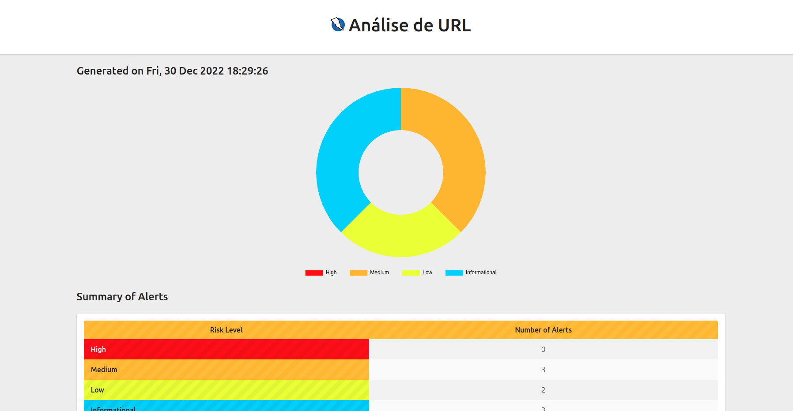

# OWASP Zap

Executar OWASP Zap em um container
```
docker run -u zap -v $(pwd)/zap:/home/zap/reports -p 8080:8080 -i owasp/zap2docker-stable zap.sh -daemon -host 0.0.0.0 -port 8080 -config api.addrs.addr.name=.* -config api.addrs.addr.regex=true -config api.key=testeapi
```

Instalar os pacotes necessários
```
npm install
```

Executar a API
```
npm run dev
```

Importar o arquivo `Insomnia.json` para seu Insomnia

Realizar as requisições

## Relatório gerado

É possível gerar relatórios parciais ou completos, ou seja, ao chamar o endpoint do relatório, mesmo não tendo terminado, ele gerará os resultados.

Para acessar o relatório usar a URL http://localhost:3000/scan/report/{scanId}


